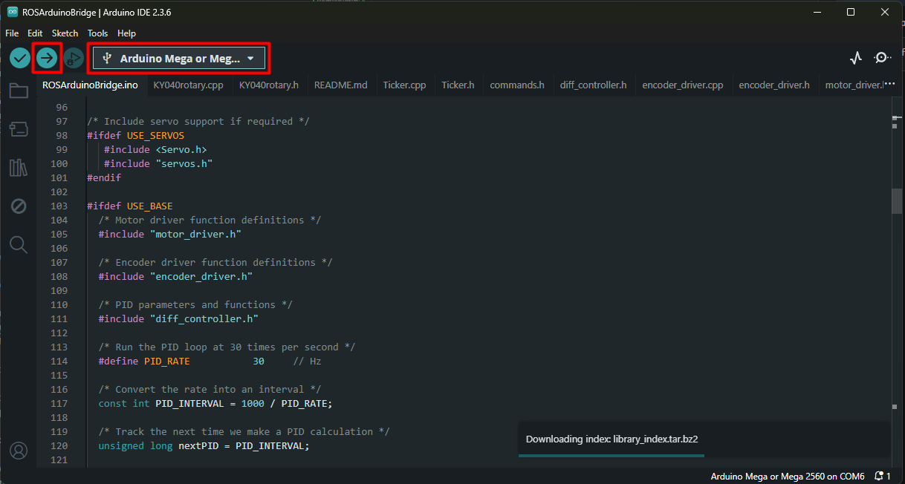
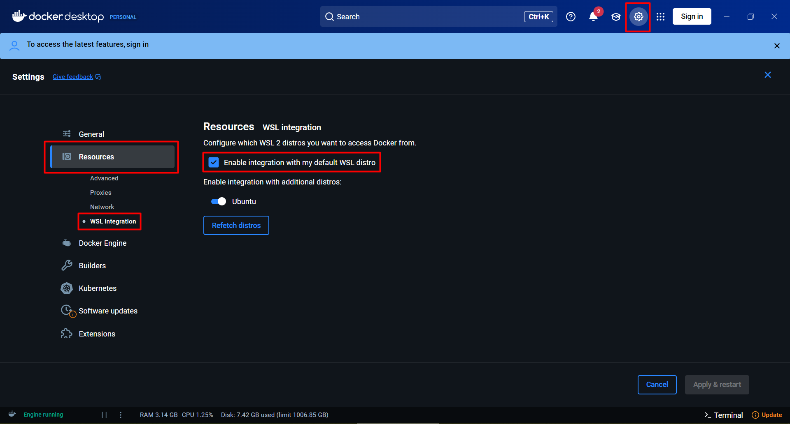
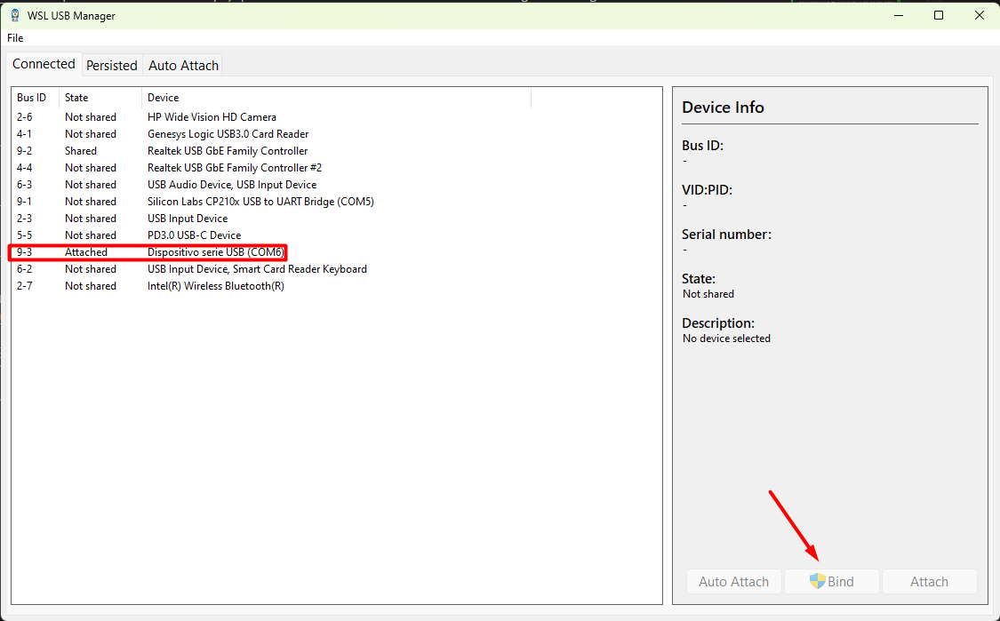
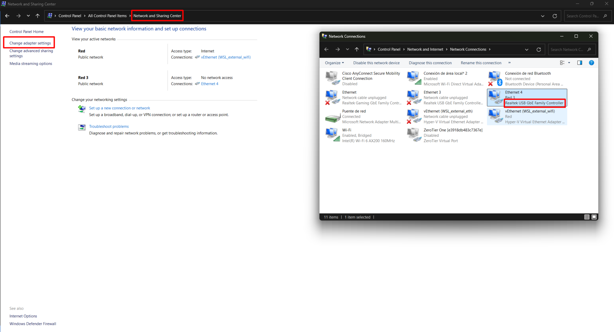
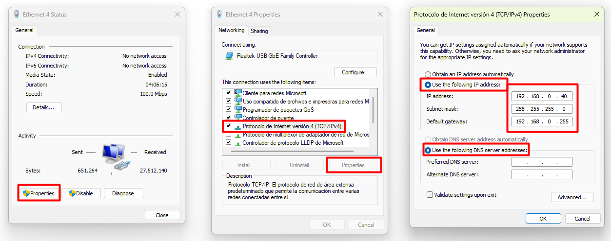

# galax_robot

If you are reading this, you have embarked on the challenging task of controlling the Galax Robot (a combination of the Pioneer-3DX and the Hokuyo UST-10 LiDAR).

Please be advised that this process requires careful attention to detail and technical expertise.

:warning: Important:

Never allow the robot's battery to discharge completely. Recovery from this state is extremely difficult, and the original programmer of the internal Arduino controllers may no longer be available for support.

If the Arduino responsible for encoder dividing fails (indicated by ROS being unable to detect wheel rotation), please refer to the following guide:
[How to Replace the encoder divider Arduino](how_to_fix_inner_arduino.md)

## Theoretical Introduction

### ROS, Ubuntu, Docker and System Integration

#### ROS

This robot is designed to be controlled via [ROS2 Humble](https://docs.ros.org/en/humble/index.html), a robotics-oriented operating system.
ROS2 is a powerful framework that enables comprehensive robot control capabilities.

It offers two main advantages:
1. Includes extensive libraries, tools, and packages for both mobile robots and robotic arms
2. Facilitates efficient data sharing between different programs
   For example, one program can acquire and publish sensor data while other programs use this data for robot control or calculations

While learning ROS is highly recommended for its utility and power, this setup is designed to enable robot control without extensive prior knowledge of the framework.

#### Ubuntu

Although ROS is compatible with multiple operating systems, it is optimized for Ubuntu, which we will use for this project.

Ubuntu is preferred by developers for its enhanced capabilities compared to Windows, offering greater functionality at the cost of a less polished interface (in our case, primarily terminal-based). It provides superior performance and simplified installation of compilers for various programming languages.
For Python or C++ development for robot control, Ubuntu is significantly more efficient than Windows.

#### Docker

Docker addresses the common issue of software compatibility and deployment. It functions as a lightweight virtualization solution that operates at a low level, making it highly efficient compared to traditional virtual machines.

Docker containers operate as isolated environments - if a program functions correctly within a container during development, it will function identically when deployed to other systems.

## Arduino

### Source Code
:warning: The robot's internal code should not be modified. If re-uploading becomes necessary, download the complete [ros_arduino_bridge](ros_arduino_bridge/) folder. Open the [ROSArduinoBridge.ino](ros_arduino_bridge/ROSArduinoBridge/ROSArduinoBridge.ino) file and upload it to the robot's Arduino:

### Libraries

The code and libraries have been manually optimized, with background tickers for constant sensor readings running in parallel. Additional modifications or debugging are not recommended.

:warning: ROS communicates with the Arduino via serial communication. Any debugging attempts using `serial.print` or `serial.write` will result in undesired behavior.

The robot's encoders generate an extremely high frequency of readings that would overload the Arduino processor. To address this, an intermediate Arduino (previously mentioned in [How to Replace the Voltage Division Arduino](how_to_fix_inner_arduino.md)) was installed to reduce the encoder reading frequency to manageable levels.

Consequently, while the encoder can count wheel pulses, it cannot distinguish rotation direction (manual wheel rotation has a 50% probability of correct direction detection).

To resolve this limitation, the wheel encoder library was modified to impose rotation direction. Motor control signals now include directional information for encoder counting.

:warning: Manual robot movement (dragging on the floor) may result in incorrect encoder readings and potential USB port damage due to overvoltage. Allow the robot to move autonomously.

## PC Configuration:

**Docker**

1. Install [Docker Desktop](https://www.docker.com/products/docker-desktop/) for Windows. Select AMD64 or ARM64 based on your system architecture.
   
   To determine your architecture:
   Windows Settings -> System -> About -> Device Specifications -> System Type:
   - x64-based processor = AMD64
   - ARM-based processor = ARM64

2. After installation, navigate to settings and ensure this option is enabled:
   

**USB Configuration**

3. Install [USB IPD](https://github.com/dorssel/usbipd-win/releases). Download the latest installer (.msi). This program enables USB connections to Docker containers.

4. Download [WSL USB Manager](https://github.com/nickbeth/wsl-usb-manager/releases/tag/v1.2.1) (installation not required). This provides a graphical interface for easier USB connection management with Docker containers.

5. Locate the "USB Serial Device (COMX)" (robot's Arduino) and select "Bind". If the button changes to "Unbind" after completion, the process was successful.
   

**LiDAR Configuration**

5. Configure a static IP for the LiDAR. Navigate to Control Panel -> Network and Sharing Center -> Change Adapter Settings, and locate "Realtek USB GbE Family Controller".

6. Select Properties -> Internet Protocol Version 4 -> Properties, and configure the values exactly as shown in the following image:

**Windows X Server**

7. Install [VcXsrv Windows X Server](https://sourceforge.net/projects/vcxsrv/). This enables Docker programs to display graphical windows.

8. Execute XLaunch (found in installed programs or at `C:\Program Files\VcXsrv\xlaunch.exe`). Select "Multiple Windows" and ensure "Disable access control" is checked.

9. Determine your local IPv4 address by running `ipconfig` in a PowerShell terminal. Look for "Ethernet adapter" (wired connection) or "Wireless LAN adapter" (Wi-Fi connection).

**Final Verification**

10. Execute the following command in a cmd or PowerShell terminal, replacing `YOUR_LOCAL_IP_ADDRESS` with your IP from the previous step:
    
    `docker run -it --rm --name galax_robot_container --network host --privileged --device /dev --volume /dev:/dev --volume /run/udev:/run/udev --volume /var/run/dbus:/var/run/dbus --volume /etc/localtime:/etc/localtime:ro --volume /tmp/.X11-unix:/tmp/.X11-unix --volume /etc/localtime:/etc/localtime:ro --env DISPLAY=YOUR_LOCAL_IP_ADDRESS:0.0 pep248/galax_robot:base_image`

11. Execute the command `rviz2`. If DISPLAY errors occur, review the previous steps. If RViz opens successfully, the configuration is correct and the window can be closed.

The installation and configuration are now complete.

:warning: The container is designed to be destroyed upon closure. No changes made within the container will persist.

## Operating Procedure

Once configuration is complete, follow this procedure each time you want to operate the robot:

1. Execute xLaunch if not already running.

2. Execute the following command in a cmd or PowerShell terminal:

`docker run -it --rm --name galax_robot_container --network host --privileged --device /dev --volume /dev:/dev --volume /run/udev:/run/udev --volume /var/run/dbus:/var/run/dbus --volume /etc/localtime:/etc/localtime:ro --volume /tmp/.X11-unix:/tmp/.X11-unix --volume /etc/localtime:/etc/localtime:ro --env DISPLAY=YOUR_LOCAL_IP_ADDRESS:0.0 pep248/galax_robot:base_image`

3. Execute WSL USB Manager if not already running. Locate the "USB Serial Device (COMX)" and select "Attach".

4. Return to the Docker container terminal and execute the desired command:

   1. Launch real robot:
      `ros2 launch galax_bringup keyboard_real_robot.launch.py`

   2. Launch simulated robot:
      `ros2 launch galax_bringup keyboard_sim_robot.launch.py`

   3. Launch simulated navigation demo:
      `ros2 launch galax_navigation launch_navigation_sim.launch.py`

   4. Launch real robot navigation demo using the UPV map:
      `ros2 launch galax_navigation launch_navigation.launch.py`

## MATLAB Code

The MATLAB code used for agent training is available in the [matlab_code](matlab_code/) directory.

The implementation includes a [training tool](matlab_code/RL_simulator.m) for loading or creating a TD3 agent and training it within a simulation environment.
The simulation environment requires the [Mobile Robotics Simulation Toolbox](https://github.com/mathworks-robotics/mobile-robotics-simulation-toolbox). Ensure MATLAB can properly locate this toolbox in your working environment.

Additionally, a [testing tool](matlab_code/RL_test.m) is provided to evaluate the performance of any trained agent.