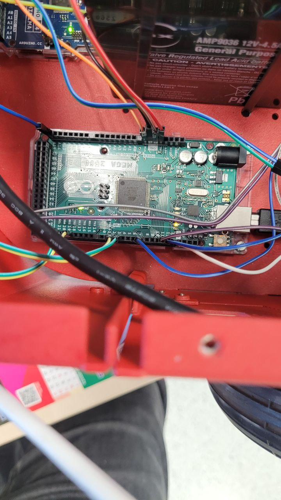
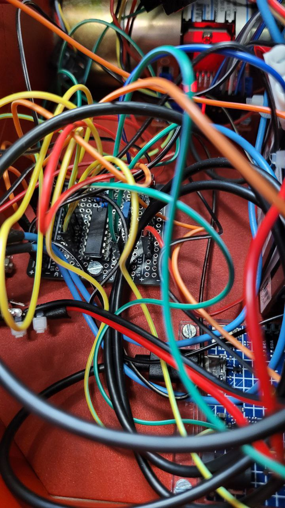
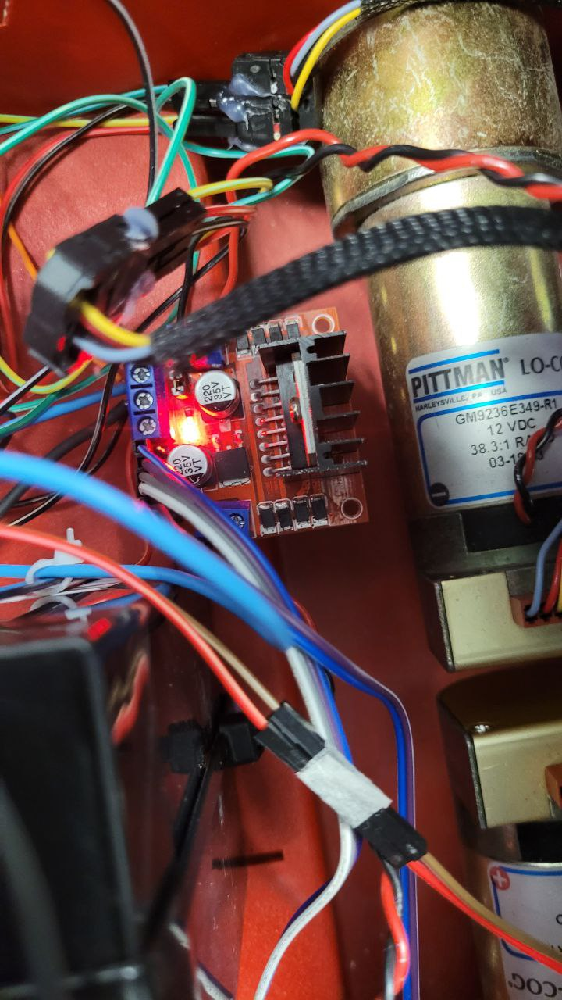
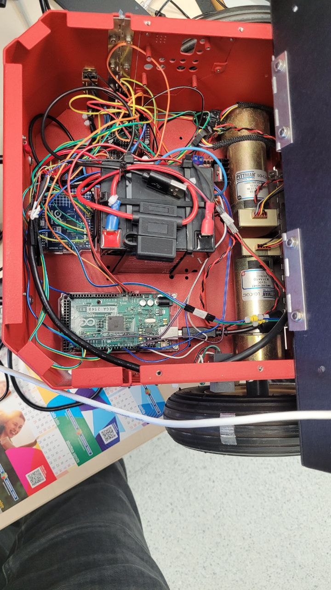
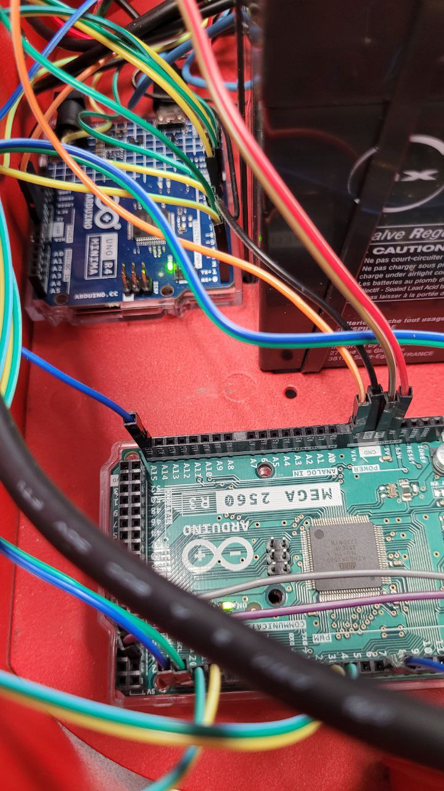
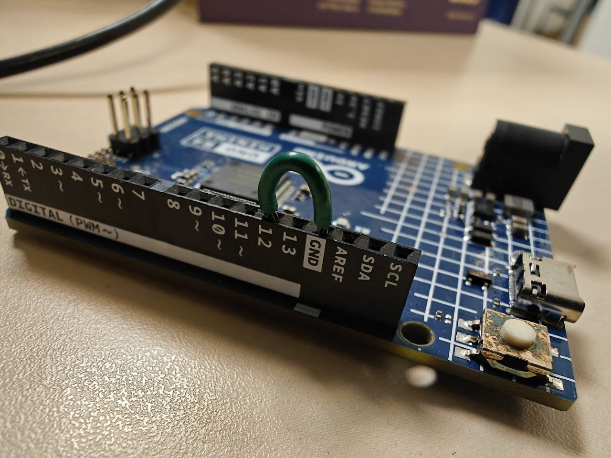
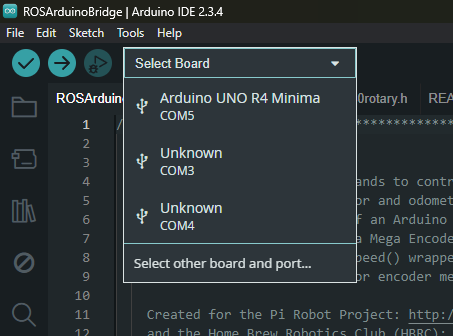
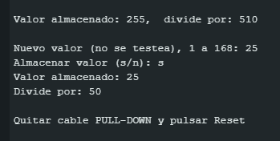

# How to replace the encoder divider Arduino

You will need a new Arduino R4, assuming the Arduino is the source of the problem.
If one wheel's rotation reading fails, the issue is with that wheel's encoder. If both wheels fail, the problem is with the Arduino.
You will also need a male-to-male jumper wire to create a bridge between two connectors on the Arduino itself.

1. Take photographs of all current connections (No schematic diagrams are available. If you disconnect a cable without documenting its location, recovery may be impossible).
   Some reference images are provided below, but do not rely solely on these for guidance.

   
   
   
   
   

2. Disconnect the faulty Arduino R4 along with all cables connected to its pins, then install the new Arduino, ensuring all cables are reconnected to their corresponding pins.

3. Create a bridge using the additional cable between pin 12 and GND:
    
    (:warning: DO NOT DISCONNECT ANY EXISTING CONNECTIONS. THE IMAGE SHOWS ONLY THE BRIDGE CONNECTION; ALL OTHER CABLES SHOULD REMAIN CONNECTED)

4. Connect the new Arduino to your computer and open the Arduino IDE. If not installed, download it from [Arduino IDE](https://www.arduino.cc/en/software/#ide).

5. Download and open the code found in the [ISR_Div](./ISR_Div/ISR_Div.ino) folder using the Arduino IDE.
   
6. Select the Arduino R4 port:
   

7. Open the Serial Monitor and set the Baud Rate to 115200.

8. Upload the code to the board using the Upload button.

9. In the Serial Monitor, the message "Nuevo valor (no se testea), 1 a 168:" will appear.
   Enter the value "25" (without quotes) and press Enter.
   If executed correctly, the result should appear as shown:
   
   
10. Remove the jumper wire used for the bridge in step 3. The repair is now complete.